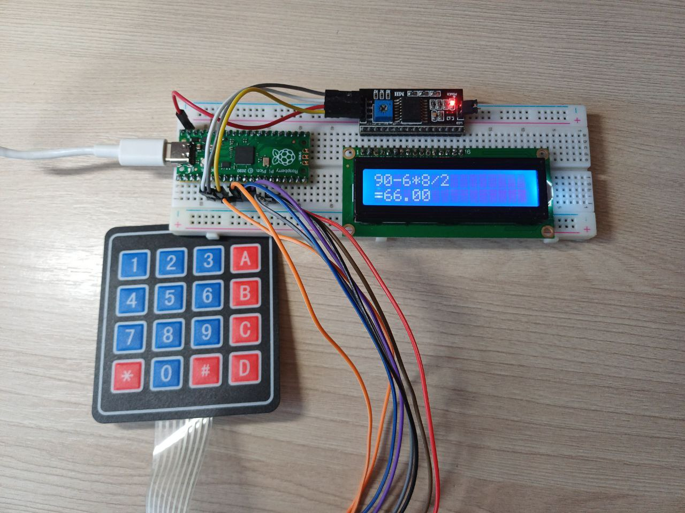

# Pico Calculator

Hardware calculator with evaluation engine to perform basic math.

Based on my implementation of Shunting Yard math evaluation, respects all signs, supports floating point numbers.

## Features

- Automatic backlight to save power when no user input
- Evaluation engine respects math rules
- Supports floating point numbers

## Hardware

- Raspberry Pi Pico
- LCD 16x2 (I2C)
- 4x4 keypad

### Picture

